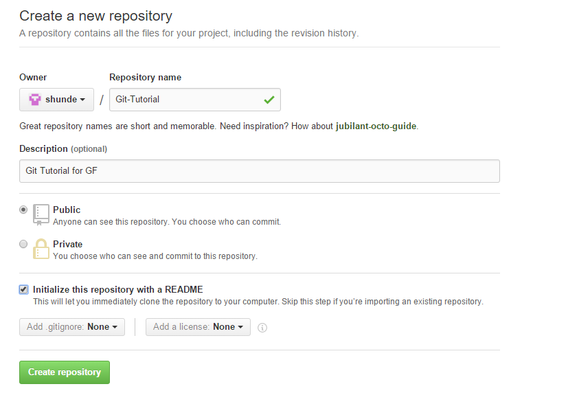
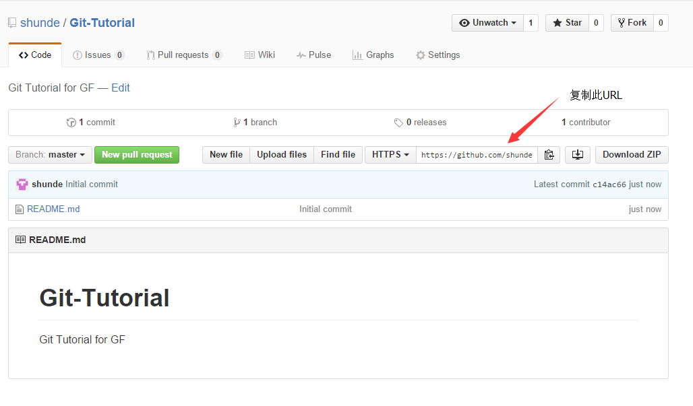
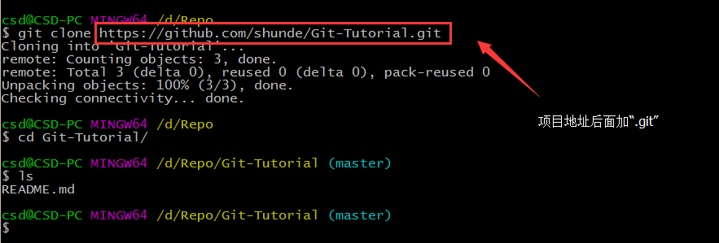

# 在 Github 上新建仓库

## 1 新建仓库（Repository）
打开 [Github](https://github.com) 主页，点击 “+” 图标，新建仓库。

按图操作即可。

创建完后，会进入到该仓库主页，如下所示。

复制仓库的Git地址。

## 2 拉取到本地

打开终端 Shell，用 `git clone` 命令将新建仓库拉取到本地。

就是辣么简单^_^
